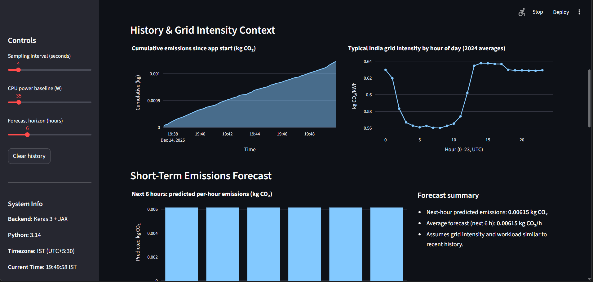
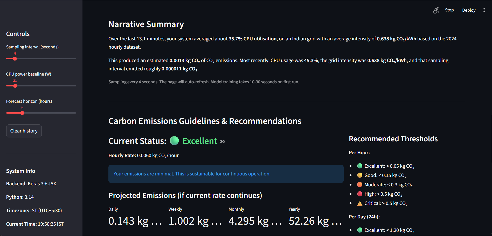

# CarbonCompute: Real-time Carbon Monitor and Forecast

[](https://www.python.org/downloads/)
[](https://streamlit.io/)
[](https://www.tensorflow.org/)

A real-time carbon footprint tracking and forecasting system that monitors carbon intensity data and predicts future trends using LSTM neural networks.

## Overview

CarbonCompute provides real-time monitoring and predictive analytics for carbon emissions intensity. The application leverages historical hourly carbon intensity data for India (2024) and uses deep learning models to forecast future carbon emissions patterns, helping users make informed decisions about energy consumption.

## Features

- **Real-time Carbon Monitoring**: Track current carbon intensity levels
- **Historical Data Analysis**: Visualize hourly carbon intensity trends throughout 2024
- **LSTM-based Forecasting**: Predict future carbon intensity using trained LSTM neural networks
- **Interactive Dashboard**: Built with Streamlit for an intuitive user experience
- **Data-Driven Insights**: Make environmentally conscious decisions based on carbon intensity predictions

## Tech Stack

- **Python 3.8+**: Core programming language
- **Streamlit**: Web application framework for the interactive dashboard
- **TensorFlow/Keras**: Deep learning framework for LSTM model
- **Pandas**: Data manipulation and analysis
- **NumPy**: Numerical computing
- **Matplotlib/Plotly**: Data visualization

## Project Structure
```
CarbonCompute-Realtime-carbon-monitor-and-forecast/
├── streamlit_app.py          # Main Streamlit application
├── emissions_core.py          # Core emissions calculation logic
├── lstm_forecast.keras        # Pre-trained LSTM model
├── IN_2024_hourly.csv        # Historical carbon intensity data for India
├── screenshots/              # Application preview screenshots
├── requirements.txt           # Python dependencies
├── __pycache__/              # Python cache files
└── README.md                 # Project documentation
```

## Preview Screenshots

<div align="center">
  <table>
    <tr>
      <td></td>
      <td></td>
    </tr>
    <tr>
      <td></td>
      <td></td>
    </tr>
  </table>
</div>

## Installation

### Prerequisites

- Python 3.8 or higher
- pip package manager

### Setup

1. Clone the repository:
```bash
git clone https://github.com/vignesh-poovanna/CarbonCompute-Realtime-carbon-monitor-and-forecast.git
cd CarbonCompute-Realtime-carbon-monitor-and-forecast
```

2. Install required dependencies:
```bash
pip install -r requirements.txt
```

3. Run the application:
```bash
streamlit run streamlit_app.py
```

4. Open your browser and navigate to `http://localhost:8501`

## Usage

### Running the Dashboard

After starting the Streamlit application, you can:

1. View real-time carbon intensity data
2. Explore historical trends through interactive visualizations
3. Access forecasted carbon intensity predictions
4. Analyze patterns to optimize energy consumption during low-carbon periods

### Understanding the Data

The `IN_2024_hourly.csv` file contains hourly carbon intensity measurements for India throughout 2024. Carbon intensity is measured in grams of CO2 equivalent per kilowatt-hour (gCO2eq/kWh).

### Model Forecasting

The pre-trained LSTM model (`lstm_forecast.keras`) has been trained on historical patterns to predict future carbon intensity levels. The model considers:
- Temporal patterns (time of day, day of week)
- Seasonal variations
- Historical trends

## How It Works

1. **Data Collection**: Historical carbon intensity data is loaded from the CSV file
2. **Data Processing**: The `emissions_core.py` module processes and prepares the data
3. **Visualization**: Streamlit displays interactive charts and metrics
4. **Forecasting**: The LSTM model predicts future carbon intensity based on historical patterns
5. **Insights**: Users can identify optimal times for energy-intensive activities

## Model Architecture

The LSTM (Long Short-Term Memory) neural network is particularly suited for time-series forecasting due to its ability to:
- Capture long-term dependencies in sequential data
- Remember patterns over extended periods
- Handle non-linear relationships in carbon intensity fluctuations


## Future Enhancements

- [ ] Support for multiple countries and regions
- [ ] Real-time API integration for live carbon intensity data
- [ ] Mobile-responsive dashboard
- [ ] Email/SMS alerts for optimal energy consumption times
- [ ] Integration with smart home systems
- [ ] Advanced forecasting models (GRU, Transformer-based)
- [ ] Carbon footprint calculator for specific activities
- [ ] Historical comparison tools

## Data Source

The carbon intensity data is based on India's power grid emissions for 2024, measured hourly throughout the year.

## License

This project is open source and available under the MIT License.


## Acknowledgments

- Carbon intensity data providers
- Open-source community
- TensorFlow and Streamlit teams

---

**Made with ❤️ for a greener planet**

*Help reduce your carbon footprint by timing your energy consumption with CarbonCompute*
